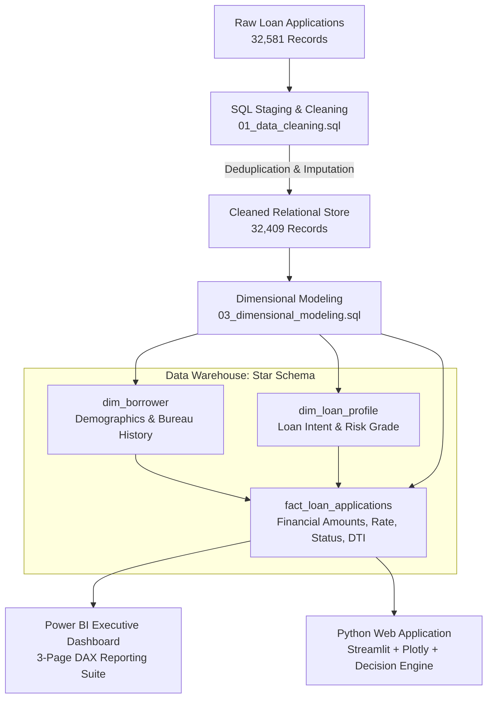
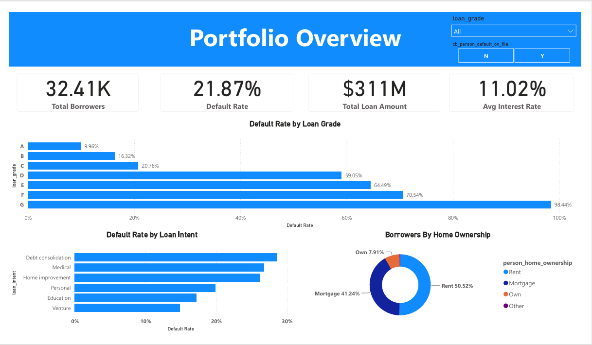
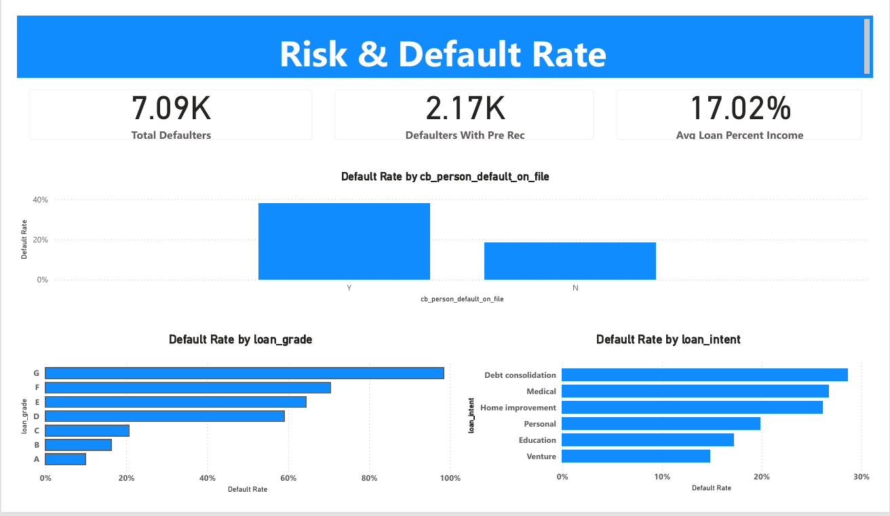
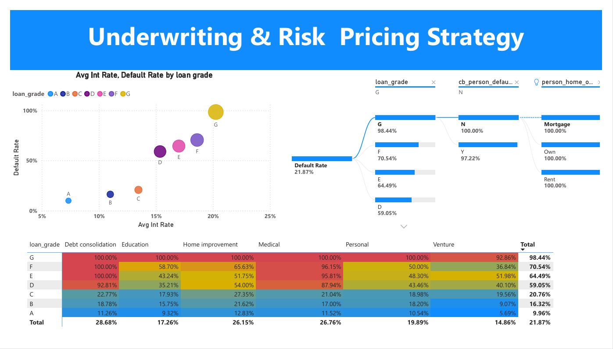

# Enterprise Credit Risk Analytics & Underwriting Platform

[](https://python.org)
[](https://streamlit.io)
[](https://mysql.com)
[](https://powerbi.microsoft.com)
[](#data-model)
[](LICENSE)

An enterprise-grade credit risk analytics and automated underwriting platform designed for retail and commercial lending portfolios. The platform features an end-to-end analytics workflow: raw applicant data ingestion and hygiene in SQL, dimensional Star Schema modeling, an interactive 3-page Power BI executive report, and a deployed Python/Streamlit web application with an automated underwriting decision calculator.

---

## 📌 Business & Executive Summary

In retail lending, managing credit risk requires balancing portfolio growth with loan delinquency mitigation. Analyzing a lending book of **32,409 loan accounts** representing **$310.9M in total funded exposure**, this project establishes data pipelines, diagnostic dashboards, and underwriting decision rules to evaluate loan default probability.

### Core Portfolio Findings
- **Overall Portfolio Health**: Total volume of **$310.9M** with an aggregate default rate of **21.87%** and an average contractual interest rate of **11.01%**.
- **Risk-Based Pricing Alignment**: Default rates scale predictably from **9.96% in Grade A** to **98.44% in Grade G**, validating the credit grading framework while identifying severe subprime exposure.
- **Credit Bureau Multiplier**: Applicants with an existing default record default at **37.86%**, more than **double (2.05x)** that of clean bureau applicants (**18.44%**).
- **Debt-to-Income (DTI) Critical Tipping Point**: When the loan amount exceeds **20% of annual income**, default probability surges from **13.56%** to **40.53%**.
- **Loan Purpose Vulnerability**: **Debt consolidation** carries the highest default rate among all loan intents, while **Renters** comprise 50.52% of borrower volume.

---

## 🏗️ Technical Architecture & Pipeline



---

## 🛠️ Technology Stack

- **Data Warehousing & ETL**: MySQL 8.0 / ANSI SQL (Window functions `ROW_NUMBER()`, conditional aggregation, group-average imputation).
- **Dimensional Modeling**: Enterprise Star Schema (Fact and Dimension surrogate keys, Kimball methodology).
- **Business Intelligence**: Power BI Desktop, DAX Measures, Power Query (M).
- **Application Engineering**: Python 3.10+, Streamlit, Plotly Express & Graph Objects, Pandas, NumPy.
- **Deployment**: Streamlit Community Cloud / Docker containerization ready.

---

## 📂 Repository Structure

```
credit-risk-analytics/
├── app.py                      # Interactive Python/Streamlit web application
├── requirements.txt            # Python dependencies
├── .streamlit/
│   └── config.toml             # Custom theme and server settings
├── data/
│   ├── credit_risk_dataset.csv # Raw applicant dataset
│   └── CREDIT_RISK2.csv        # Cleaned and validated dataset (32,409 rows)
├── sql/
│   ├── 01_data_cleaning.sql    # Data staging, deduplication, and anomaly removal
│   ├── 02_exploratory_data_analysis.sql # Diagnostic portfolio and risk queries
│   └── 03_dimensional_modeling.sql      # Star Schema DDL and ELT transformations
├── power_bi/
│   └── Credit Risk2.pbix       # Interactive 3-page Power BI report file
├── assets/                     # Visual architecture diagrams and dashboard previews
│   ├── portfolio_overview.png
│   ├── risk_default_rate.Png
│   ├── underwriting_risk_pricing_strategy.Png
│   └── 0.1 star_schema_credit.png
├── docs/
│   ├── data_model.md           # Formal data warehouse schema and data dictionary
│   └── INTERVIEW_GUIDE.md      # Comprehensive technical interview preparation guide
├── LICENSE                     # Apache 2.0 Open Source License
└── README.md
```

---

## 💻 Running the Application Locally

### Prerequisites
- Python 3.9 or higher
- Git

### Installation & Execution
```bash
# 1. Clone the repository
git clone https://github.com/dishajain260/credit-risk-analytics.git
cd credit-risk-analytics

# 2. Install dependencies
pip install -r requirements.txt

# 3. Launch the Streamlit application
streamlit run app.py
```
Open [http://localhost:8501](http://localhost:8501) in your browser.

---

## 🌐 1-Click Cloud Deployment (Streamlit Community Cloud)

This repository is pre-configured for free cloud deployment:
1. Fork or push this repository to your GitHub profile.
2. Sign in to [share.streamlit.io](https://share.streamlit.io/) with your GitHub account.
3. Click **"New app"**, select `dishajain260/credit-risk-analytics`, and set Main file path to `app.py`.
4. Click **Deploy!** Your interactive app will be live with a shareable public URL.

---

## 📊 Dashboard & Platform Preview

### 1. Executive Portfolio Overview


### 2. Risk & Default Rate Drivers


### 3. Underwriting & Risk-Based Pricing Strategy


---

## 📐 Data Warehouse Model

The platform implements a **Star Schema** with one fact table and two dimension tables:
- `fact_loan_applications`: Stores loan amounts, interest rates, DTI, and default outcomes.
- `dim_borrower`: Demographic, socioeconomic, and credit bureau indicators.
- `dim_loan_profile`: Loan intent, risk grades (A–G), and expected loss tiers.

📄 [Read the Complete Data Model Documentation](docs/data_model.md)

---

## 🎓 Interview & Technical Documentation

For technical discussions and job interviews (e.g., Banking Analytics, Software & BI Engineer):
📄 [Read the Complete Interview Master Guide & Cheat Sheet](docs/INTERVIEW_GUIDE.md)

---

## 👤 Author

**Disha Jain**  
- GitHub: [@dishajain260](https://github.com/dishajain260)  

---

## 📜 License

This project is licensed under the Apache License 2.0 — see the [LICENSE](LICENSE) file for details.
